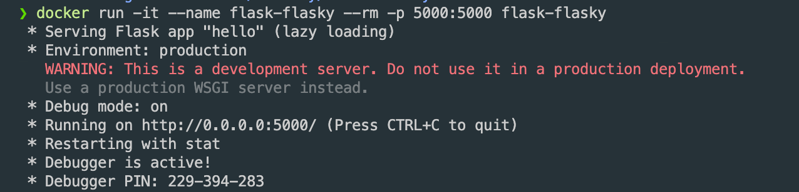
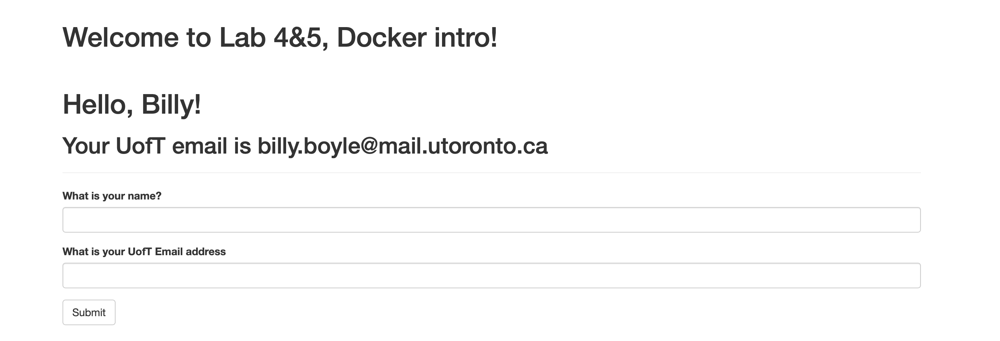
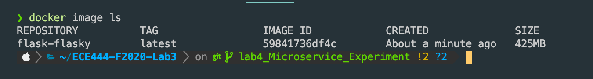

# ECE444 Lab 3

## William Boyle

This repo is a clone of [Flasky](https://github.com/miguelgrinberg/flasky) that has been Dockerized

To build the docker container execute the following command in the root directory of the repo, (which is where the Docker files are!):

`docker build -t flask-flasky:latest .`

To run the system on port 5000 use the following command:

`docker run -it --name flask-flasky --rm -p 5000:5000 flask-flasky`

The output should match the first screenshot below.

## Activity 1
Perform all development in a branch "lab4_Microservice_Experiment" in your Lab3 task GitHub repository.

## Activity 2
In addition to the code, this branch should contain a README.md file, (this file), that describes how to build and start the system.

## Activity 3
Briefly summarize the difference between Docker and Virtual Machine.

The biggest difference is the low level implementation of Docker vs a Virtual Machine. Docker is container based and therfore shares the host OS kernel. A Virtual Machine is not container based and is made up of user space plus kernel space of an operating system. One of the most common analogies is that of appartments (shared plumbing/facilities) vs stand-alone houses.