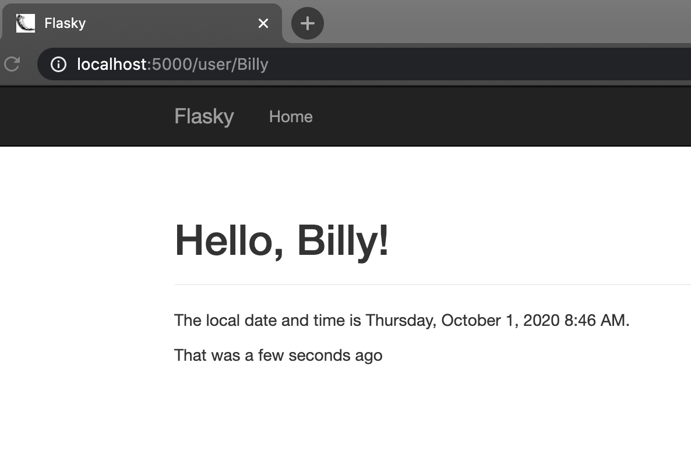
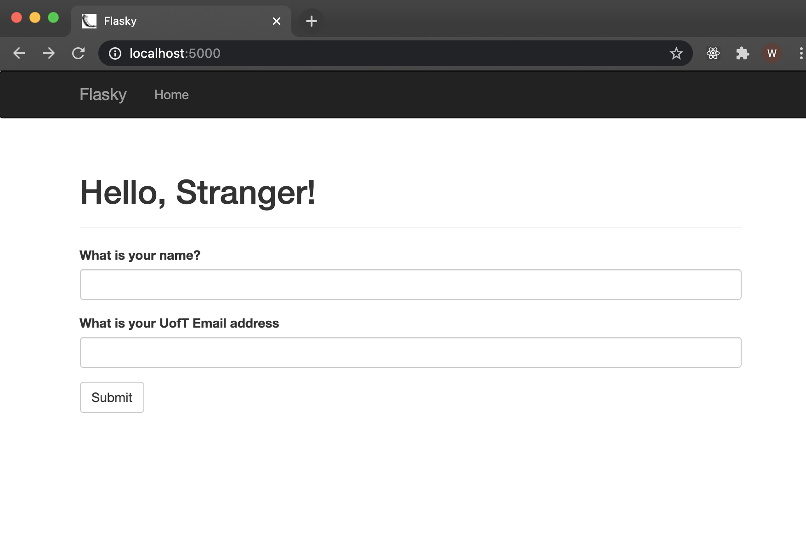
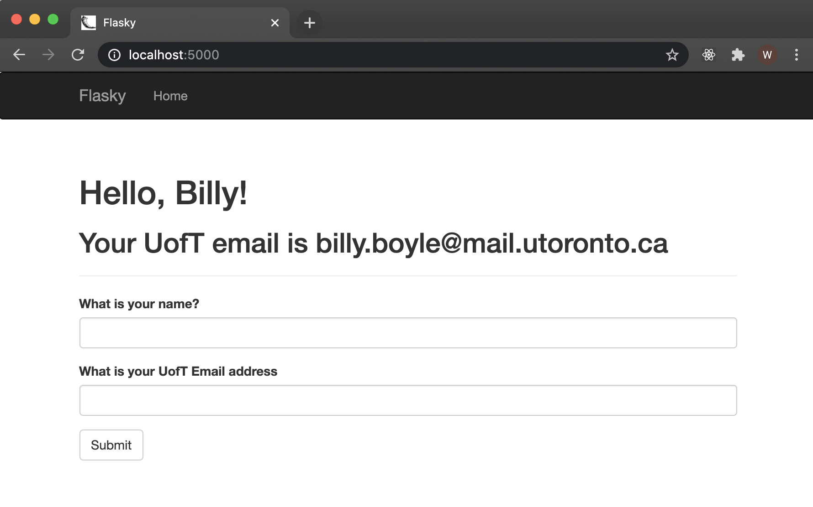
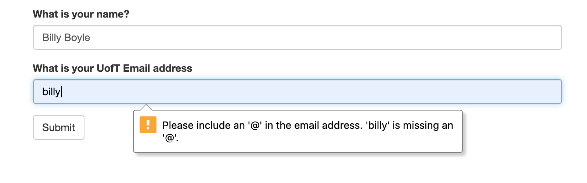
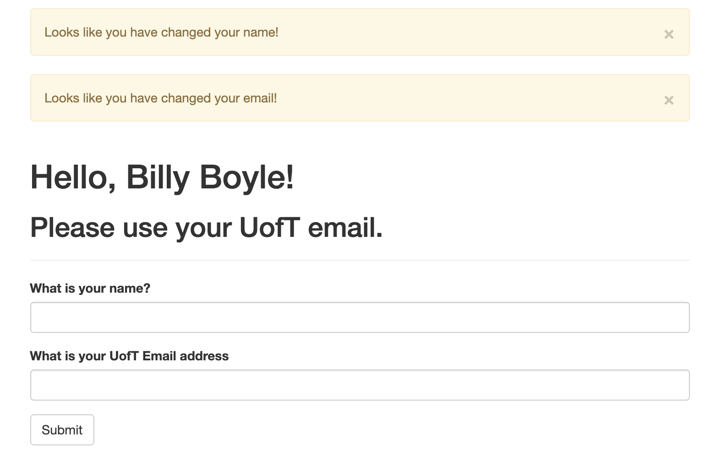

# ECE444 Lab 3

## William Boyle

This repo is a clone of [Flasky](https://github.com/miguelgrinberg/flasky)

## Activity 1
Replay and modify example in Chapter 3

## Activity 2
Replay and modify example in Chapter 4

## Activity 3
Briefly summarize the difference between SQL and NoSQL databases.

The biggest difference between SQL and NoSQL databases is that the SQL database is relational where the NoSQL is non-relational, (although it could be argued that all data is in fact relational, the NoSQL structure does not use this fact where the SQL structure relies heavily on it.) The basics of this difference comes down to the way the data is organized. In SQL data will be aranged in tables with a predefined schema that will store structured data whereas NoSQL will use documents or key-value pairs and dynamic schemas to store unstructured data. 

In a web app such as ours the choice of SQL vs NoSQL is largely a matter of what you're comfortable with, but I find the organization of the SQL database is much easier to understand and far easier to picture, which nine times out of ten makes it the better choice for my applications.